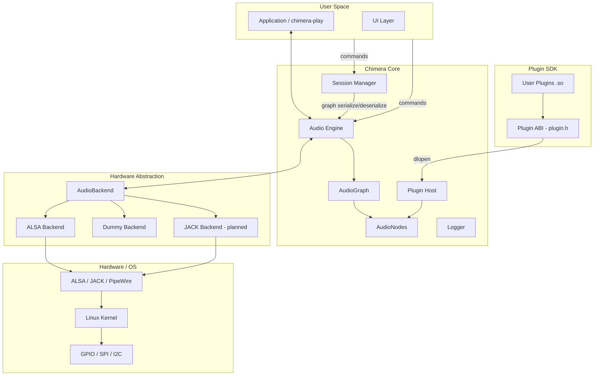
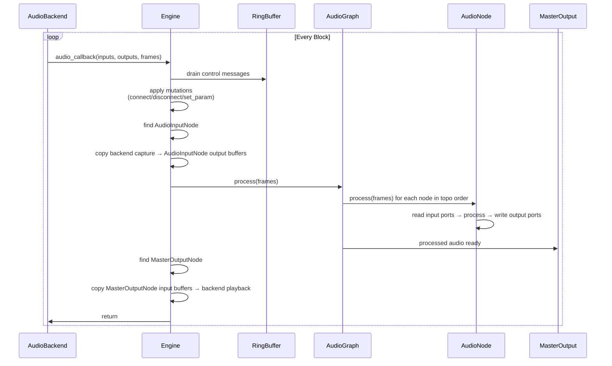
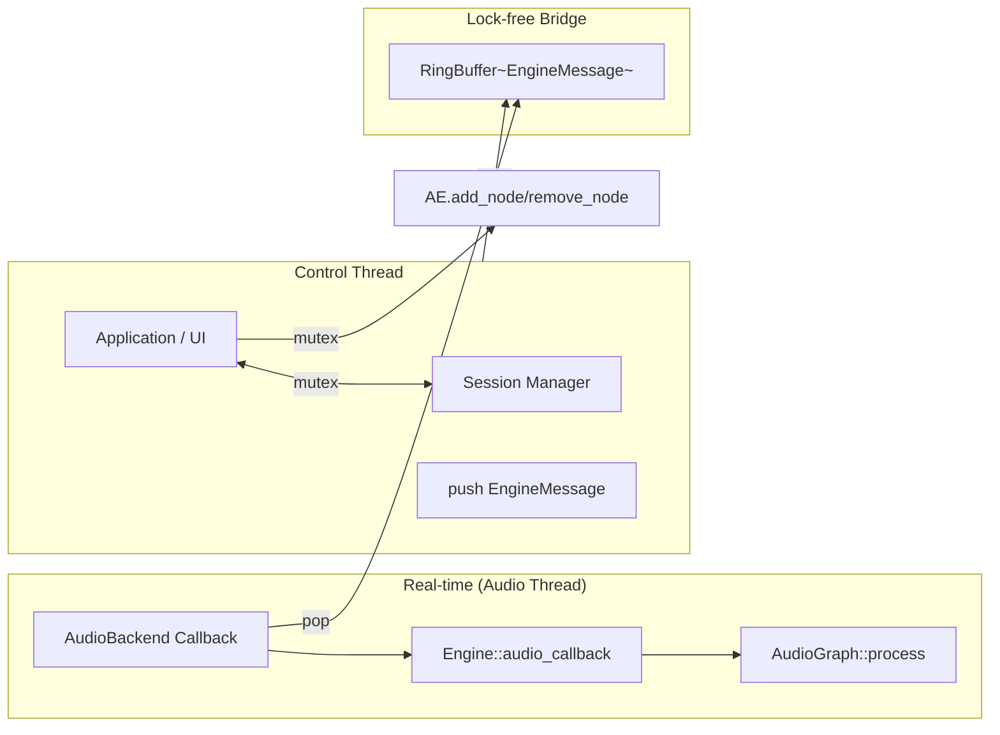
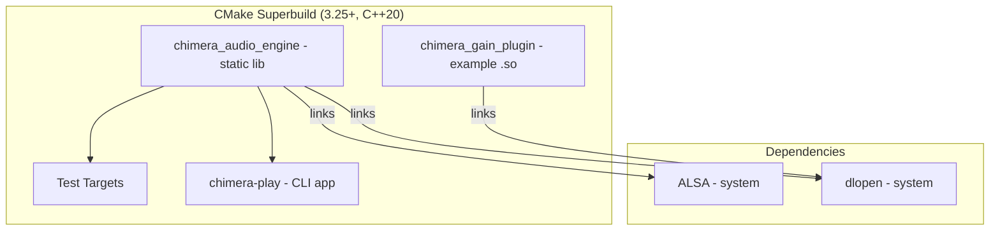

# System Architecture

## Hardware Topology

```mermaid
graph TB
    subgraph RPi5["Raspberry Pi 5 (Main Compute)"]
        AE[Audio Engine]
        PH[Plugin Host]
        SM[Session Manager]
        APP[Application Layer]
        UI[UI Framework]
        LOG[Logger]
    end

    subgraph RP2040["RP2040 (Low-latency I/O)"]
        BTN[Buttons / Encoders]
        LED[LED Grid]
        OLED[OLED Display]
    end

    subgraph ESP32["ESP32 (Wireless)"]
        BLE[BLE MIDI]
        OSC[OSC Server]
        WIFI[Wi-Fi Config]
    end

    subgraph ZERO["Pi Zero + E-Ink"]
        STATUS[Status Display]
    end

    RPi5 <-->|GPIO / SPI / I2C| RP2040
    RPi5 <-->|UART / Wi-Fi| ESP32
    RPi5 -->|HDMI| DISPLAY[7" TFT Touch]
    RPi5 <-->|USB| AUDIO[USB Audio Interface]
    RPi5 -->|eInk HAT| ZERO
```

## Software Stack



## Core Architecture

```mermaid
classDiagram
    class Engine {
        +AudioGraph graph
        +AudioBackend* backend
        +RingBuffer~EngineMessage~ control_queue
        +TransportState state
        +double sample_rate
        +uint32_t block_size
        +start()
        +stop()
        +pause()
        +resume()
        +audio_callback()
    }

    class AudioGraph {
        +map~NodeID, unique_ptr~AudioNode~~ nodes
        +vector~Connection~ connections
        +bool topo_dirty
        +process()
        +add_node()
        +remove_node()
        +connect()
        +disconnect()
    }

    class AudioNode {
        <<abstract>>
        +vector~Port~ inputs
        +vector~Port~ outputs
        +NodeID id
        +string node_class
        +prepare(sample_rate, block_size)
        +process(num_frames)
        +release()
    }

    class Port {
        +PortDirection direction
        +PortType type
        +AudioBuffer buffer
    }

    class AudioBuffer {
        +float* data
        +uint32_t capacity
        +uint32_t num_channels
    }

    class RingBuffer~T~ {
        +push(item)
        +pop() optional~T~
        +reset()
    }

    class AudioBackend {
        <<interface>>
        +init(sample_rate, block_size, config)
        +start()
        +stop()
        +is_running()
        +set_callback(callback)
    }

    class TransportState {
        <<enum>>
        Stopped
        Playing
        Paused
        Loop
    }

    Engine --> AudioGraph
    Engine --> AudioBackend
    Engine --> RingBuffer~EngineMessage~
    AudioGraph --> AudioNode
    AudioNode --> Port
    Port --> AudioBuffer
    AudioBackend -->|callback| Engine
```

## Data Flow (Audio Cycle)



## Threading Model



## Key Principles

- **Zero allocations in the audio thread**: all buffers pre-allocated in `prepare()`
- **Lock-free control channel**: `RingBuffer<EngineMessage>` for cross-thread commands
- **Topological sort on dirty flag**: graph re-orders on connection change, cached until next mutation
- **No RTTI, no exceptions, no C++ name mangling across plugin boundary**: pure C ABI
- **Backend abstraction**: `AudioBackend` interface allows ALSA, JACK, PipeWire, Dummy without changing Engine

---

## Build System


