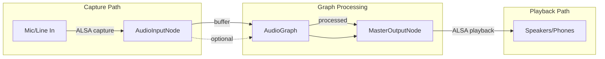
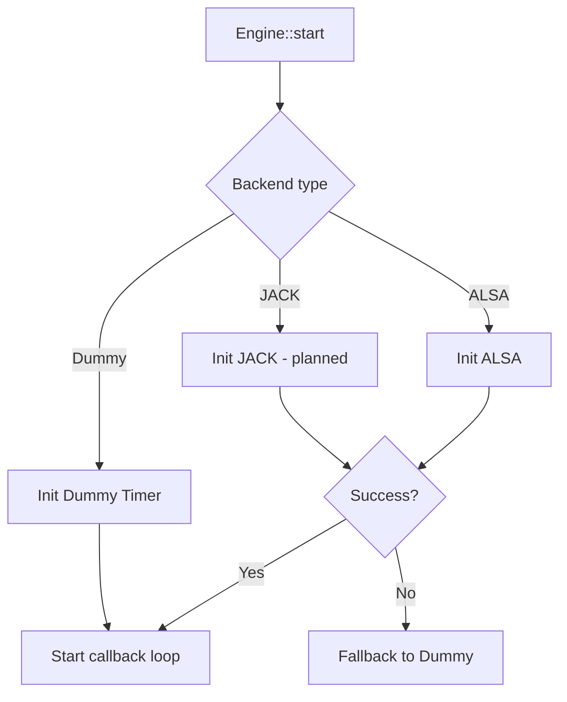
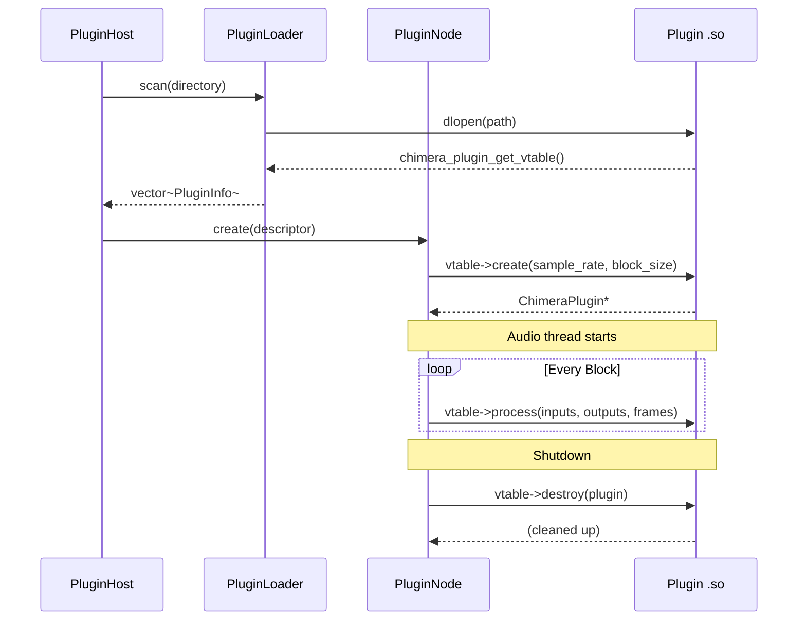
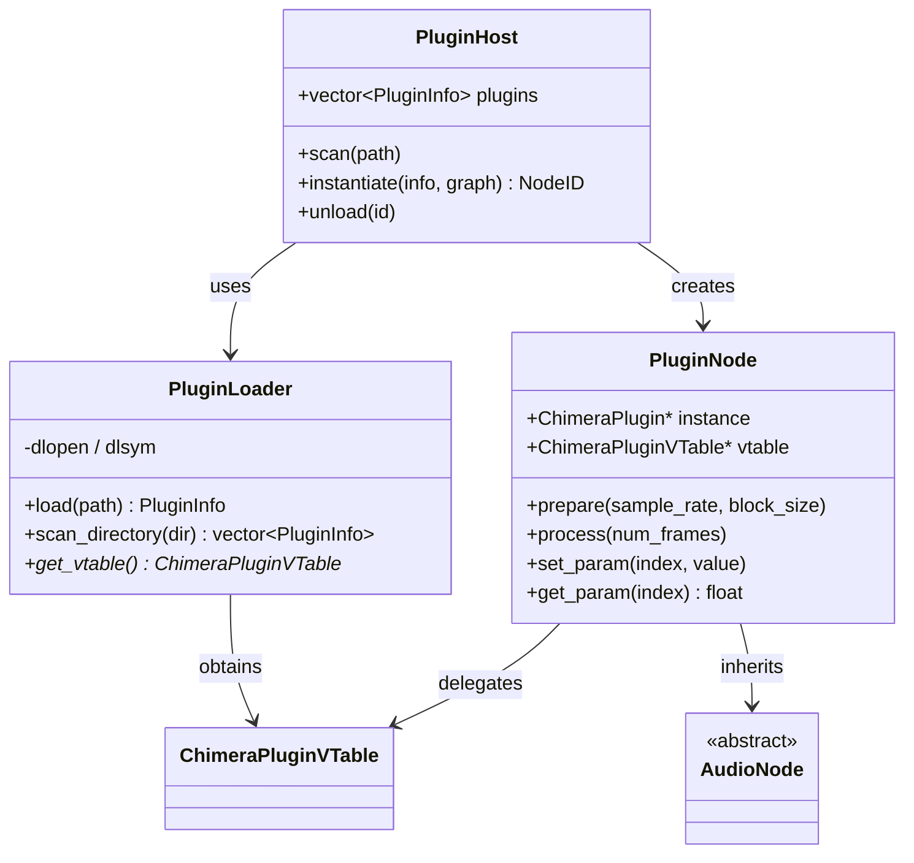
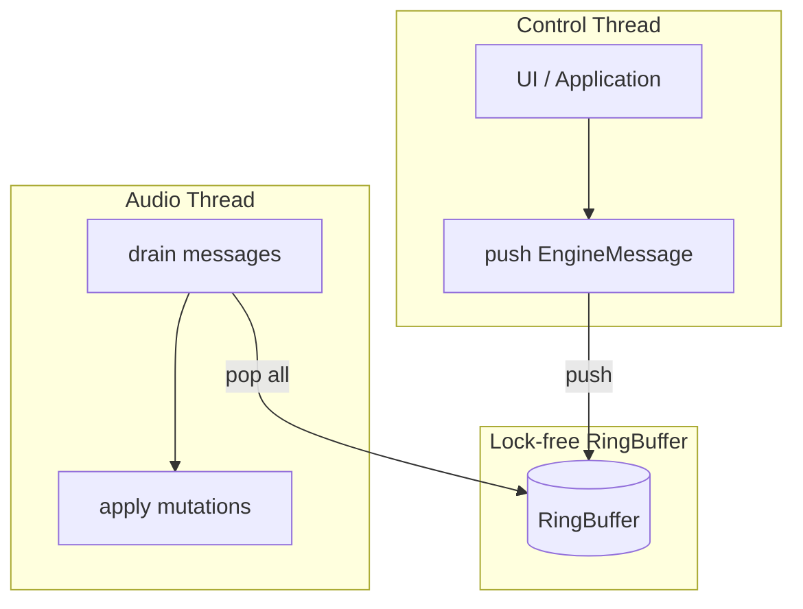
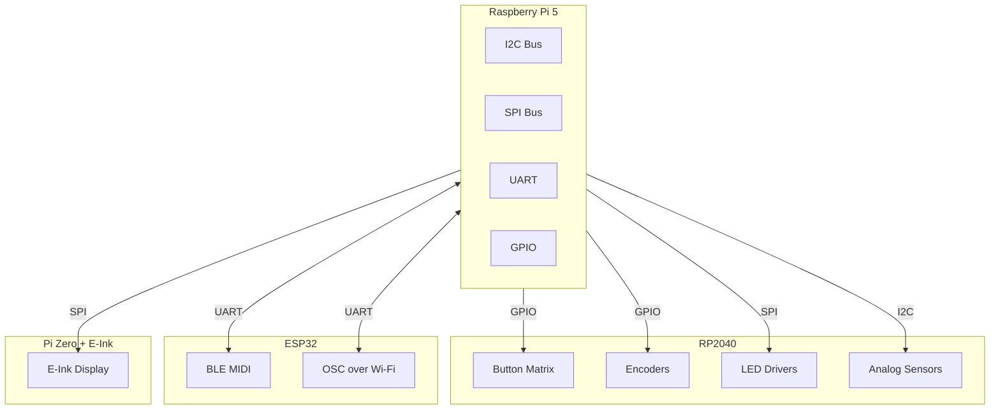

# Interfaces & Connections

## Overview

Chimera defines four categories of interface:

| Interface | Domain | Direction | Real-time? |
|---|---|---|---|
| Audio I/O | Sample data | Engine ↔ System | ✅ Yes |
| Plugin ABI | DSP code | Engine ↔ Plugin .so | ✅ Yes |
| Control Channel | Parameters, transport | Control thread → Audio thread | ✅ Yes (lock-free) |
| Hardware I/O | GPIO, MIDI, display | System ↔ RP2040/ESP32 | ❌ No (polled/event) |

---

## Audio I/O Interface

### AudioBackend (Abstract)

All audio backends implement this pure virtual interface:

```cpp
struct AudioBackendConfig {
    std::string audio_device = "default";
    std::string client_name = "Chimera";
    uint32_t num_inputs = 0;
    uint32_t num_outputs = 2;
};

class AudioBackend {
public:
    virtual ~AudioBackend() = default;
    virtual bool init(double sample_rate, uint32_t block_size,
                      const AudioBackendConfig& config) = 0;
    virtual bool start() = 0;
    virtual bool stop() = 0;
    virtual bool is_running() const = 0;

    using AudioCallback = std::function<void(const float** inputs,
                                              float** outputs,
                                              uint32_t num_frames)>;
    virtual void set_callback(AudioCallback cb) = 0;
    virtual const char* name() const = 0;
};
```

### Backend Implementations

| Backend | Status | Notes |
|---|---|---|
| `DummyBackend` | ✅ Complete | Timer-driven, no real audio hardware |
| `AlsaBackend` | ✅ Complete | PCM playback + capture, float/s16, xrun recovery |
| `JackBackend` | 🔜 Planned | JACK client with real process callback |

### Audio Signal Flow



### Backend Selection Flow



---

## Plugin ABI

### ABI Contract

The plugin boundary is pure C — no RTTI, no exceptions, no C++ name mangling.

```c
// plugin.h (simplified)
typedef struct ChimeraPluginDescriptor {
    uint32_t api_version;            // CHIMERA_PLUGIN_API_VERSION
    char name[64];
    char vendor[64];
    char version[64];
    uint32_t num_audio_inputs;
    uint32_t num_audio_outputs;
    uint32_t num_params;
} ChimeraPluginDescriptor;

typedef struct ChimeraPluginVTable {
    ChimeraPlugin* (*create)(double sample_rate, uint32_t block_size);
    void          (*destroy)(ChimeraPlugin* plugin);
    void          (*process)(ChimeraPlugin* plugin,
                             const ChimeraPort* inputs, uint32_t num_inputs,
                             ChimeraPort* outputs, uint32_t num_outputs,
                             uint32_t num_frames);
    void          (*set_param)(ChimeraPlugin* plugin, uint32_t index, float value);
    float         (*get_param)(ChimeraPlugin* plugin, uint32_t index);
} ChimeraPluginVTable;
```

### Plugin Lifecycle



### Plugin Host Architecture



---

## Control Channel

### EngineMessage Queue

Cross-thread communication uses a lock-free SPSC `RingBuffer<EngineMessage>`:

```cpp
enum class EngineMessageType {
    Connect,
    Disconnect,
    RemoveNode,
    SetParam,
    TransportPlay,
    TransportStop,
    TransportPause,
    TransportResume,
    SetPosition,
};

struct EngineMessage {
    EngineMessageType type;
    NodeID node_id;
    NodeID target_id;
    uint32_t port_index;
    uint32_t target_port;
    uint32_t param_index;
    float param_value;
    uint64_t position_frames;
};
```

### Message Flow



### Graph Mutation Safety

| Operation | Thread Safety | Mechanism |
|---|---|---|
| `add_node()` | Control thread only | `std::mutex` (transfers ownership) |
| `remove_node()` | Control thread → message | Queued, applied in audio callback |
| `connect()` / `disconnect()` | Control thread → message | Queued, sets `topo_dirty` |
| `set_param()` | Any thread → message | Queued, applied per-node |
| `process()` | Audio thread only | No locks, no allocations |

---

## Hardware I/O (Planned)



### Hardware Interface Summary

| Interface | Protocol | Device | Purpose |
|---|---|---|---|
| Button matrix | GPIO matrix scan | RP2040 | Performance controls |
| Rotary encoders | GPIO quad decode | RP2040 | Parameter adjustment |
| LED grid | SPI / WS2812 | RP2040 | Visual feedback |
| Analog sensors | I2C / ADC | RP2040 | Expression, CV input |
| MIDI | USB / DIN / BLE | ESP32 | External controllers |
| OSC | UDP / Wi-Fi | ESP32 | Network control |
| Status display | SPI / HAT | Pi Zero | Persistent info |

---

## Display Interfaces

| Display | Connection | Resolution | Content |
|---|---|---|---|
| Primary TFT | HDMI / DSI | 1024×600 | Main UI |
| E-Ink pHAT | GPIO / SPI | 264×176 | Persistent status |
| RP2040 OLED | I2C | 128×64 | Context hints |
