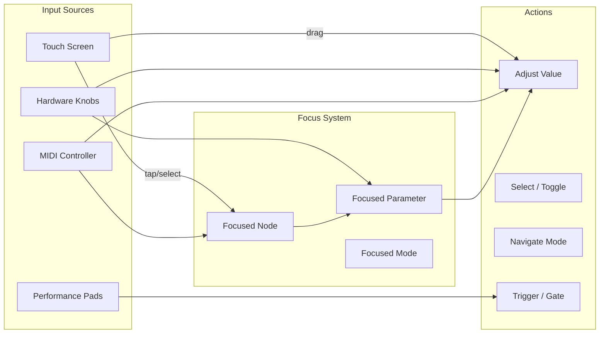
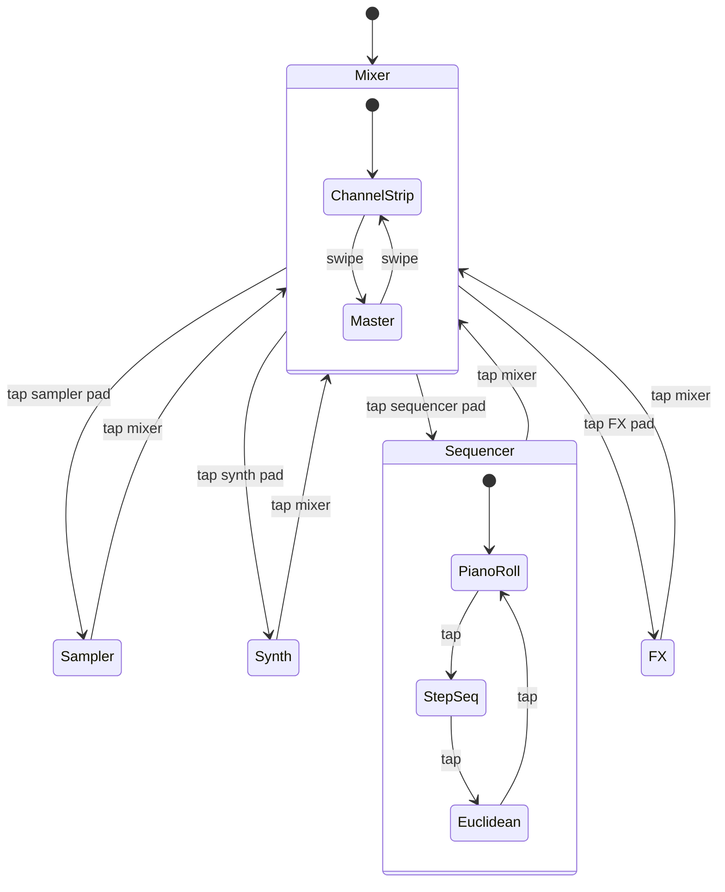
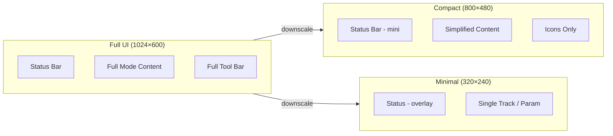

# UX / UI Design

## Philosophy

Chimera is not a DAW. It is a **performance instrument that can behave like a DAW when needed**.

- Touch-first — the 7" display is the primary interaction surface
- No keyboard or mouse required for normal operation
- Everything is reachable in ≤3 taps
- Visual feedback is immediate and unambiguous
- Hardware controls (knobs, pads, encoders) always map to the focused parameter

## Screen Architecture

```mermaid
graph TB
    subgraph MAIN["Main Display (7" TFT, 1024×600)"]
        SB[Status Bar - top]
        MC[Mode Content - center]
        TB[Tool Bar - bottom]
    end

    subgraph EINK["E-Ink (264×176)"]
        EI[Persistent State]
        EI2[Current Mode]
        EI3[CPU / Load]
    end

    subgraph OLED["RP2040 OLED (128×64)"]
        OL1[Parameter Name]
        OL2[Parameter Value]
        OL3[Mini VU Meter]
    end

    MAIN -->|mirrors| EINK
    MAIN -->|context| OLED
```

## Interaction Model



## Mode Architecture

Every view is a **mode**. Modes are mutually exclusive — only one is active at a time.



### Modes

| Mode | Purpose | Key UI Elements |
|---|---|---|
| **Mixer** | Channel levels, routing, master bus | Faders, VU meters, mute/solo, sends |
| **Sampler** | Record, slice, trigger, loop | Waveform display, slice markers, pad grid |
| **Synth** | Sound design | Knob-per-param, modulation matrix, keyboard |
| **Sequencer** | Pattern programming | Piano roll, step grid, probability lanes |
| **FX** | Effects chain | Rack view, param list, bypass |
| **File Browser** | Load/save projects, samples | Tree view, preview, metadata |
| **Settings** | System configuration | List view, toggles, sliders |
| **Performance** | Live set view | Pads, scenes, clip launcher |

## Main Display Layout

```
┌──────────────────────────────────────────┐
│  Status Bar: BPM | Mode | Load | Record  │  ← 40px
├──────────────────────────────────────────┤
│                                          │
│          Mode Content Area                │  ← 480px
│   (changes by mode: mixer strips,         │
│    waveform, piano roll, etc.)           │
│                                          │
│                                          │
├──────────────────────────────────────────┤
│  Tool Bar: Pad Grid | Quick Controls     │  ← 80px
│  [Mixer][Sampler][Synth][Seq][FX][Files] │
└──────────────────────────────────────────┘
```

### Status Bar (Top)

Persistent across all modes:
- **Left**: Current BPM / time signature
- **Center**: Current mode name + active scene
- **Right**: CPU load bar, audio load bar, record enable, MIDI activity LED

### Mode Content (Center)

Changes entirely based on the active mode. Examples:

**Mixer Mode:**
```
┌──────┬──────┬──────┬──────┬──────┬──────┐
│ CH 1 │ CH 2 │ CH 3 │ CH 4 │ CH 5 │ MAST │
│ ████ │ ███  │ █████│ ██   │ ████ │ █████│
│ ████ │ ███  │ █████│ ██   │ ████ │ █████│  VU meters
│ ████ │ ███  │ █████│ ██   │ ████ │ █████│
│──────│──────│──────│──────│──────│──────│
│   S  │   S  │   S  │   S  │   S  │      │  Sends
│ M M  │ M M  │ M M  │ M M  │ M M  │      │  Mute/Solo
│-40dB │-12dB │ -6dB │-20dB │-3dB  │ -6dB │  Level
└──────┴──────┴──────┴──────┴──────┴──────┘
```

**Sampler Mode:**
```
┌──────────────────────────────────────────┐
│  ┌────────────────────────────────────┐  │
│  │   ▁▄▆█▇▆▄▂▁   ▁▂▃▄▅▆▇█▇▆▅▄▃▂▁  │  │  Waveform
│  │   ▔▔▔▔▔▔▔▔▔   ▔▔▔▔▔▔▔▔▔▔▔▔▔▔▔  │  │
│  └────────────────────────────────────┘  │
│  [Play] [Stop] [Loop] [Slice] [Reverse]  │
│  Start: 0.000    End: 2.347    Len: 2.347│
│  ┌──┐ ┌──┐ ┌──┐ ┌──┐ ┌──┐ ┌──┐ ┌──┐    │
│  │C3│ │D3│ │E3│ │F3│ │G3│ │A3│ │B3│    │  Pad grid
│  └──┘ └──┘ └──┘ └──┘ └──┘ └──┘ └──┘    │
└──────────────────────────────────────────┘
```

**Sequencer Mode:**
```
┌──────────────────────────────────────────┐
│  ┌────────────────────────────────────┐  │
│  │▪ ░ ░ ░ ░ ░ ░ ░ ░ ░ ░ ░ ░ ░ ░ ░ ░│  │  1/16 notes
│  │▪ ░ ░ ░ ▪ ░ ░ ░ ░ ░ ░ ░ ░ ░ ░ ░ ░│  │
│  │▪ ░ ░ ░ ░ ░ ░ ░ ░ ░ ░ ░ ░ ░ ░ ░ ░│  │
│  │▪ ░ ░ ░ ░ ░ ░ ░ ░ ░ ░ ░ ░ ░ ░ ░ ░│  │
│  │▪ ░ ░ ░ ░ ░ ░ ░ ░ ░ ░ ░ ░ ░ ░ ░ ░│  │
│  │▪ ░ ░ ░ ░ ░ ░ ░ ░ ░ ░ ░ ░ ░ ░ ░ ░│  │  Piano roll
│  │▪ ░ ░ ░ ░ ░ ░ ░ ░ ░ ░ ░ ░ ░ ░ ░ ░│  │
│  │▪ ░ ░ ░ ░ ░ ░ ░ ░ ░ ░ ░ ░ ░ ░ ░ ░│  │
│  └────────────────────────────────────┘  │
│  [Pattern 1/8] [Steps:16] [Res:1/16]     │
│  Vel:120  Prob:90%  Gate:75%             │
└──────────────────────────────────────────┘
```

### Tool Bar (Bottom)

- Context-sensitive pad grid (1-4 rows depending on mode)
- Mode selector tabs: Mixer | Sampler | Synth | Seq | FX | Files

## Color System

| Color | Meaning | Use |
|---|---|---|
| Blue (primary) | Active, selected | Current mode, selected track |
| Green | Signal present | VU meter low range, gate open |
| Yellow | Approaching limit | VU meter high range, warning |
| Red | Clip / overload | VU meter peak, record armed |
| White | Default / neutral | Unselected elements, labels |
| Gray / Dim | Inactive, bypassed | Disabled tracks, muted channels |

## Touch Gestures

| Gesture | Action |
|---|---|
| Tap | Select / toggle / trigger |
| Drag (vertical) | Adjust fader / slider value |
| Drag (horizontal) | Scrub waveform / scroll |
| Swipe (left/right) | Navigate between channels / pages |
| Pinch | Zoom waveform / piano roll |
| Long press | Context menu / parameter edit |

## Hardware Controls (RP2040)

| Control | Mapping | Feedback |
|---|---|---|
| 8x Encoders | Adjust focused parameters (per-mode) | RGB LED ring per encoder |
| 16x Performance Pads | Trigger samples / scenes / notes | RGB per-pad LED |
| 4x Navigation Buttons | Mode up/down, back, menu | Button LED |
| 2x Footswitch Inputs | Start/stop, tap tempo, hold | - |

## Responsive Scaling



- Full UI targets 7" TFT (1024×600)
- Compact UI targets smaller displays or reduced mode
- Minimal UI targets RP2040 OLED or remote control

## Performance Visualizations (Planned)

- **VU Meter**: Per-channel level bars with peak hold, color-coded
- **Waveform**: Sample display with slice markers, zoom, scrub
- **Spectrum Analyzer**: FFT-based real-time frequency display
- **Oscilloscope**: Time-domain waveform per channel
- **Vector Scope**: Lissajous XY display for stereo imaging
- **Modulation Matrix**: Visual routing of LFOs/envelopes to targets

## Accessibility

- High-contrast mode for outdoor/stage use
- Adjustable font size for parameter names/values
- Audio feedback (click, tone) on UI actions
- Configurable color-blind palette
